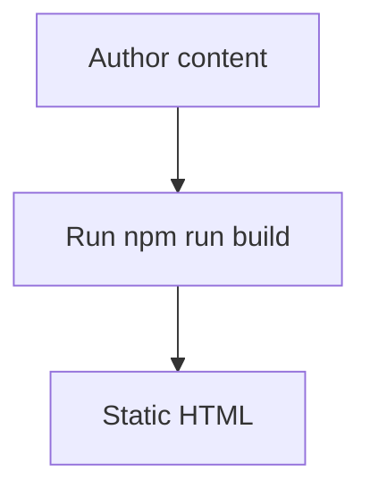

This sample post shows the Markdown + sidecar JSON authoring flow used by the standalone generator.

## Metadata pairing

- `public/blog/2025/doc-template.md`
- `public/blog/2025/doc-template.json`

## Code fences

Use `line=` to highlight 1-based line numbers relative to the code fence. Separate individual lines with commas and use a hyphen for a range, such as `line=2,4-5`. `lineOffset` changes the displayed line numbers, not which lines are highlighted.

```typescript line=2 lineOffset=10
const title = 'Documentation Template';
console.log(title);
const category = 'Guide';
console.log(category);
const published = true;
console.log(published);
```

## Mermaid extension point


