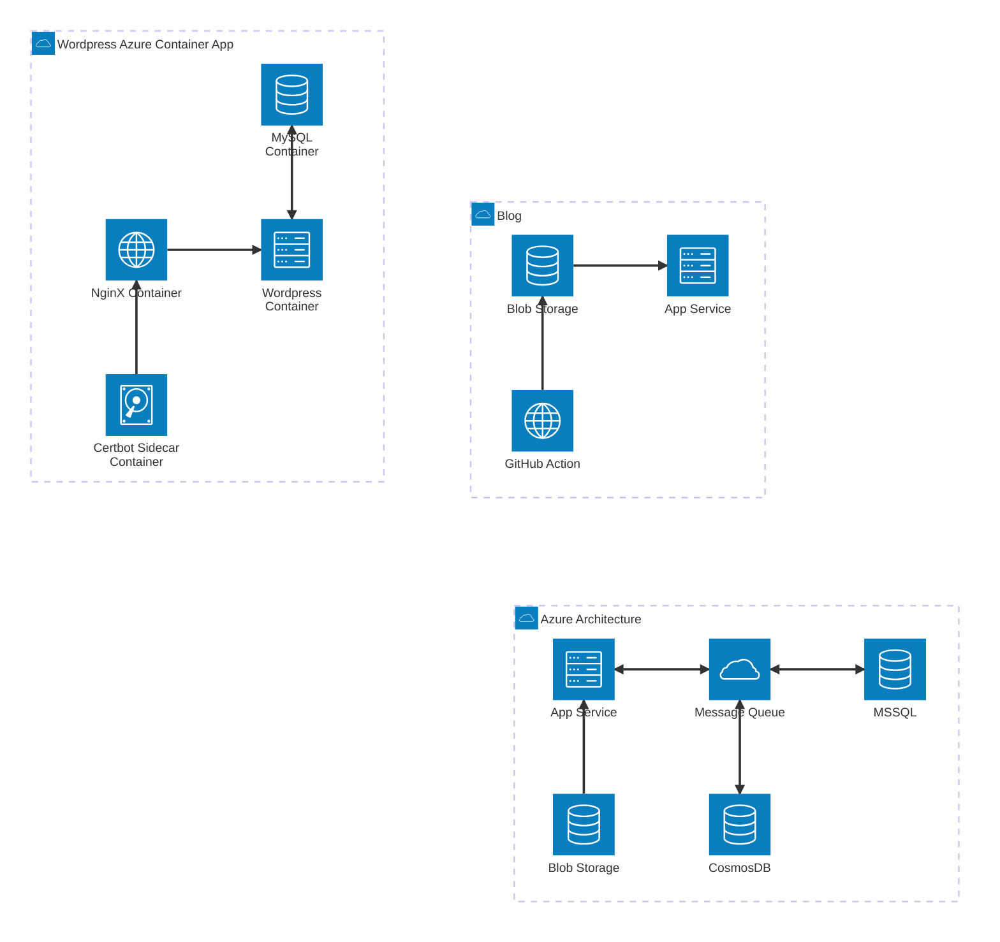

This is a simple demo of the blog features

# Markdown Header

- Supports markdown format e.g. lists
- Supports **bold**, italic, and __underscore__
- Supports markdown files, html, and typescript-rendered pages

## Code Blocks

Code block with line highlighting

```typescript line=4
const test = "hello";
console.log(test + " world");
// highlight the following line
console.info("this should be highlighted.");
const test2 = 5;
```

Code block with lines highlighted and offset
```typescript line=4-6 lineOffset=100
const test = "hello";
console.log(test + " world");
// highlight the following line
console.info("this should be highlighted.");
const test2 = 5;
const test3 = test + ", this is Johnny " + test2;
console.log("test", test3);
```

Code block from remote URL
```html source=https://raw.githubusercontent.com/jburditt/fullswing-angular-library/refs/heads/main/projects/fullswing-blog/src/app/app.html
```

## Mermaid Diagrams


