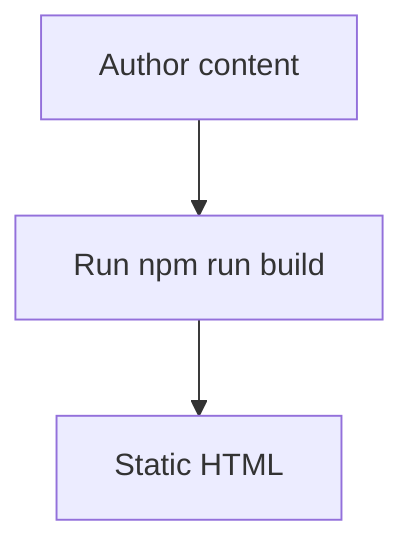

This sample post shows the Markdown + sidecar JSON authoring flow used by the standalone generator.

## Metadata pairing

- `public/blog/2025/doc-template.md`
- `public/blog/2025/doc-template.json`

## Code fences

```typescript line=2 lineOffset=10
const title = 'Documentation Template';
console.log(title);
```

## Mermaid extension point


